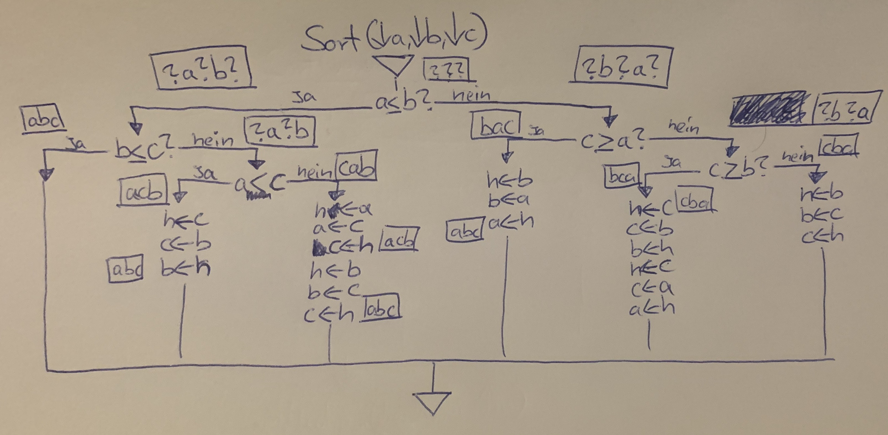
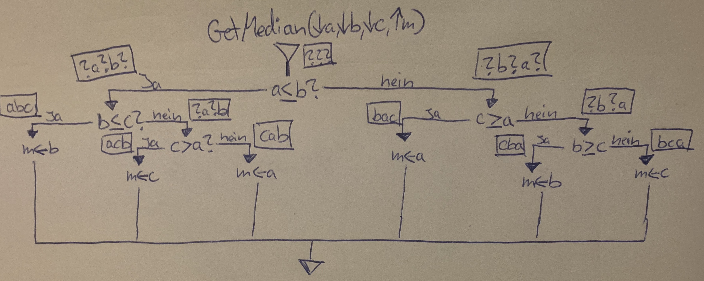
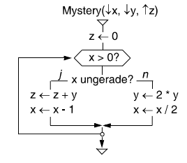
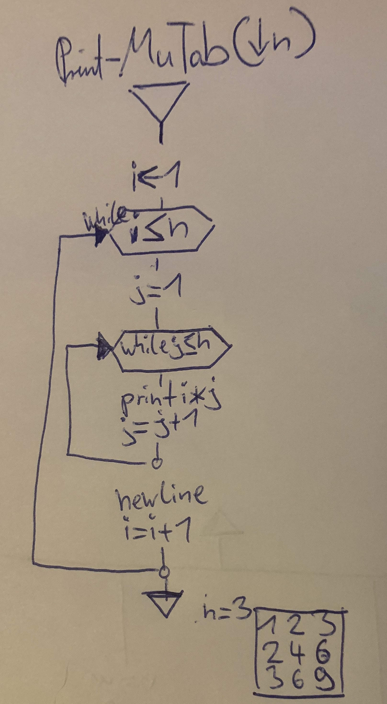

# Chaper 1 - Exercises

### 1) Liegt jedem Programm ein Algorithmus zugrunde? Kann man jeden Algorithmus als Programm formulieren?
- Jedes Programm hat die Aufgabe eine Lösung für ein Problem zu bieten welches aus vielen Teilproblemen bestehen kann
- Dabei arbeiten alle herkömmlichen Programme sequentiell und präzise schrittweise
- Damit ist jedes Program wie ein Kochrezept mit Anweisung zum Erhalten eines Ergebnisses und kann in sich viele Algorithmen vereinen

### 2) Erklären Sie den Unterschieden zwischen einer Variable und einem Wert
- Eine Variable ist ein ein Behälter für Werte, welcher eine ansprechbare Speicheradresse als Namen besitzt
- Eine Variable kann je nach Datentyp verschiedene Wertearten halten und neuzugewiesen bekommen
- Ein Wert kann verschieden Typen haben ob ganzzahl, char oder string und in variablen zwischengespeichert werden
- Werte sind konstant

### 3) Warum gibt man Variablen einen Datentyp? Diskutieren Sie vor- und Nachteile.
- Der Computer muss unterschiedliche Mengen an Speicher reservieren ob eine Zahl wenige oder hunderte Stellen hat
- Wenn der Rechner weiß, dass er nur wenig Platz reservieren muss kann er sehr viel effizienter arbeiten
- Bei Anweisungen und Berechnungen muss definiert sein wie verschiedene Daten miteinander verrechnet oder verglichen werden können, das geht nur mit Typen
- Typen bringen Struktur und Einheitlichkeit in die Programmiersprache
- Programmierfehler können durch Prüfungen von Typen verhindert werden

### 4) Sortieren dreier Zahlen. Gegeben 3 Zahlenvariablen a, b und c. Schreiben Sie einen Algorithmus Sort, der die Variablen nach a <= b <= c sortiert. Angabe als Ablaufdiagramm mit Assertions.

### 5) Median dreier Zahlen bestimmen durch Ablaufdiagramm eines Algorithmus GetMedian mit gegebenen Variablen a, b, c. Rückgabe des Medians in Variable m. Angabe mit Assertions und möglichst wenig Abfragen.

### 6) Was macht folgender Algorithmus? Variablen haben ganze Zahlen, Divison schneidet Nachkommastellen ab.

| x             | y             | z  | 
| ------------- |:-------------:| -----:|
| 3      | 2 |  0|
| 2     | 2      |   2 | 
| 1 | 4      |    2 | 
| 0 | 4      |    **6** | 
- Der Algorithmus berechnet das Produkt aus x und y in Variable z, hier 3 * 2 = **6**

### 7) Schreibe Schreibtischtest für den euklidischen Algorithmus mit x= 96, y=36 und x=53 und y=12:

| x             | y             | rest  | ggt   |
| ------------- |:-------------:| -----:| -----:|
| 96            | 36            | 24    |       |
| 36            | 24            | 12    |       |
| 24            | 12            | 0     |  12   |

| x             | y             | rest  | ggt   |
| ------------- |:-------------:| -----:| -----:|
| 53            | 12            | 5     |       |
| 12            | 5             | 2     |       |
| 5             | 2             | 1     |       |
| 2             | 1             |  0    | **1** |

### 8) Erzeuge einen Diagrammablauf für einen Algorithmus Print-MulTab der n als Paremeter akzeptiert und eine Multiplationstablle bis n printed.

### Alle folgenden Aufgaben sind nicht prüfungsrelevant