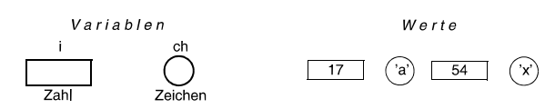
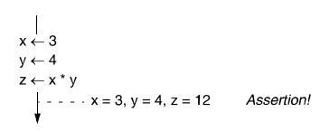
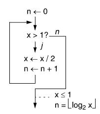
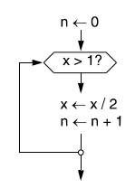

# Programmieren mit Java

## Allgemein Programmieren
- Programmieren ist kreative Tätigkeit
- Programme sind wie gebaute Objekte, nur immateriell
- Computer arbeiten sequentiell, daher müssen Anweisen sehr präzise sein
- Programmierer denken mit Variablen und Objekten in höherer Abstraktion als Binärform oder Maschinencode

## Daten und Befehle
- Ein Programm ist Daten + Befehle
- Daten können Zahlen, Text, Bild oder Video sein
- Befehle sind Operationen auf Daten
- Befehle sind eingeschränkt lassen aber unglaublich komplexe Zusammensetzung zu
- Daten werden im Speicher abgelegt, der mit Adressen angesprochen wird
- Speicher besteht aus Zellen, die Adresse als Name haben und Werte in sich tragen
- 0= 0000 1= 0001 2= 0010 3= 0011 4= 0100 5= 0101 6= 0110 7= 0110 8= 1000 9= 1001 10= 1010 11= 1011 12= 1100 13= 1101 13= 1110 15= 1111
- Ein Bit ist entweder 0 oder 1 und 8 Bits sind ein Byte
- Ein Word sind 2 oder 4 Bytes und 2 Worte sind ein Doppelwort
- Wertzuweiseungen können mit x <- 1 notiert werden
- Programme können auch die Befehle über Wertzuweisung als Daten betrachten
- Entstehen eines Programmes 1. Spezifikation/Lösungsidee -> Programm in Programmiersprache schreiben -> Compiler übersetzt in Maschinensprache -> Binder/Lader speichert es in den Speichert und führt es auf dem Computer aus

## Algorithmen
- Jedes Programm definiert eigenen Algorithmus
- Ein Algorithmus ist wie ein Rezept für das Kochen und ist schrittweise und präzise Formel für das Lösen eines Problems
- Alle Schritte müssen der Reihe nach definiert und eindeutig genau beschrieben werden
- Ein Beispielalgorithmus zum Addieren aller Zahlen bis MaxValue würde lauten:

```Summiere Zahlen
SummiereAlleZahlenBisMax(↓max ↑sum)
1. sum <- 0
2. counter <- 1
3. While counter <= max
        sum <- sum + counter
        counter += counter
```
- Bestandteile eines Algorithmus sind Name, Eingangswerte, Ausgangswerte, Folge von Schritten
- Algorithmen sind universell, können als Pseudocode definiert und in vielen Sprachen umgesetzt werden

## Variablen
- Variablen sind Behälter für Werte und speichern Daten
- Variablen haben Datentypen
- Variablen sind mehrfach zuweisbar
- In der Notation werden Variablen als Rechteckt dargestellt und Zeichen als Kreise und Werte in diese hinengeschrieben

## Anweisungen
- Anweisungen nutzen Werte von Variablen um Berechnungen auszuführen

### Wertzuweisung
- Häuftigste Art der Anweisung ist Wertzuweisung y <- x + 1 (Wert von y wird neu zugewiesen)
- Falsche Zuweisungen wären 3 <- x  oder x + y <- x + 1

### Folge (Sequenz)
- Anweisungen werden untereinandergeschrieben in Folge ausgeführt
- In der Notation wird der Kontrollfluss durch einen durchlaufenden Pfeil angedeutet
- Assertions sind Zuwsicherungen die beschreiben welchen Wert eine Variable zu einem Zeitpunkt hat
- Assertions werden mit einer gestrichelten Linie nebem dem Ablaufpfeil angezeigt


### Verzweigung
- Mit Verzweigungen kann man Anweisungen in Entweder-Oder Abläufe teilen
- Bestimmte Anweisungen werden nur ausgeführt wenn die Bedingung der Verzweigung wahr ist

- Schleifen führen dazu das bestimmte Anweisungen bedingt mehrfach ausgeführt werden können
- Schleifen benötigen eine Abbruchsbedingung um die Iteration zu beenden

=
