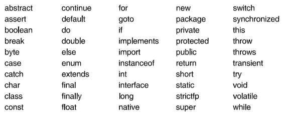

# Programmieren mit Java Chapter 2

## Einfache Programme
- Java ist eine moderne Programmiersprache
- Weite Verbreitung und sehr portabel für alle Maschinen dank jvm
- Objektierung, Komponenten, Parallelität und Exceptions werden unterstützt

## Grundsymbole
- Programme bestehen aus Namen, Keywords, Zahlen, Zeichenketten etc

### Namen

- Für Variablen, Konstanten, Typen und Methoden
- Bestehen aus Buchstaben oder Ziffern
- Erster Buchstabe muss Zeichen, _ oder $ sein (x x12 totalSum total_Sum)

### Keywords

- Es gibt reservierte Wörter wie if oder while die nicht als Variablennamen genutzt werden können
- Alle Keywords sind lowercase
- Folgende Worte sind in Java reserviert:

### Zahlen

- Ganze Zahlen können Dezimal, Hexadezimal, Binärkonstanten sein
- Dezimalzahl (0, 1000, 376)
- Hexadezimalzahl (0-9 für A-F) beginnen mit 0x (0x1A5 = 1 * 16^2 + 10 * 16^1 + 5 * 16^0) und entspricht 421
- Binärzahlen (0-1) beginnen mit 0b (0b101 = 1 * 2^2 + 0 * 2^1 + 1 * 2^0 = 5)
- Man darf in Zahlen Unterstriche einfügen, die ignoriertwerden aber zum lesen helfen (1_000_000 0x1a_c0 0b1000_0010)

### Zeichen

- Buchstaben, Ziffern und Sonderzeichen mit single quotes umklammert ('x' '+' '3')

### Zeichenketten

- Strings werden durch DoubleQuotes eingeklammert ("hallo")
- Strings dürfen Leerzeichen und Sonderzeichen enthalten
- Strings dürfen Zeilenenden nicht überschreiten
- NewLine \n 
- Escaping \"
- Inverser Schrägstrich \\