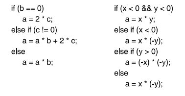

# Chapter 3 - Exercises

### 1) Schreiben Sie ein Java-Programm das drei Werte x, y und z einliost und prüft ob x,y und z nicht nur gleiche werte enthalten, ob alle drei nur verschiedene Werte enthalten und ob mindestens zwei Werte gleich sind.

```
// Given three input variables check them for equal, difference and if two are the same
public class ValueComparism {

    public static void main(String[] args) {
        Out.print("Bitte eine Ganzzahl x ein!"); // Input prompt to user
        int x = In.readInt(); // Read input as integer
        Out.print("Bitte eine Ganzzahl y ein!");
        int y = In.readInt();
        Out.print("Bitte eine Ganzzahl z ein!");
        int z = In.readInt();
        if (x == y && y == z) { // case all are the same
            Out.println("The given inputs are all of the same value.");
        } else if ( x != y && y != z) { // case none are the same
            Out.println("All the given inputs are distinct values.");
        } else { // only three given so this needs to be the case otherwise
            Out.println("Two given input values are of the same value.");
        }
    }
}
```

### 2) Schreiben Sie ein Java-Programm, das die Seitenlängen eines Dreiecks einliest und prüft ob es ein gleichseitiges oder gleichschenkliges oder rechtwinkliges, oder ein sonst gültiges oder kein Dreieck ist. Ein Dreieck ist ungültig wenn die Summe zweier Seitenlängen kleiner oder gleich der dritten Seitenlänge ist. Dreiecke können rechtwinklig und gleichschenklig sein.

```
// Given three input variables check them for their attributed of a geometric triangle
public class TriangleCalc {

    public static void main(String[] args) {
        Out.print("Bitte eine Ganzzahl x als Seitenlänge des Dreiecks ein!"); // Input prompt to user
        int x = In.readInt(); // Read input as integer
        Out.print("Bitte eine Ganzzahl y als Seitenlänge des Dreiecks ein!");
        int y = In.readInt();
        Out.print("Bitte eine Ganzzahl z als Seitenlänge des Dreiecks ein!");
        int z = In.readInt();
        if (x + y <= z || x + z <= y || y + z <= x) { // case invalid triangle
            Out.println("Eingabe eines ungültigen Dreiecks, zwei Seitenlängen kumuliert kleinergleich dritter Seitenlänge.");
        } else if (x == y && y == z) { // all triangle lengths are the same
            Out.println("Eingabe eines gleichseitigen Dreiecks.");
        } else if ((x == y || x == z || y == z) && (x * x + y * y == z * z || x * x + z * z == y * y || y * y + z * z == x * x)) { // isosceles and right triangle
            Out.println("Eingabe eines gleichschenkligen und rechtwinklingen Dreiecks.");
        } else if (x == y || x == z || y == z) { // isosceles triangle
            Out.println("Eingabe eines gleichschenkligen Dreiecks.");
        } else if (x * x + y * y == z * z || x * x + z * z == y * y || y * y + z * z == x * x) { // right triangle
            Out.println("Eingabe eines rechtwinkligen Dreiecks.");
        } else {
            Out.println("Eingabe eines sonstig gültigen Dreiecks."); // valid triangle
        }
    }
}
```

### 3) Vereinfachung boolescher Ausdrücke mit der DeMorgan Regel.

- !(x < y && y < z) -> **(x >= y || y >= z)**
- (x != y) || !(y == z && y == x) -> **(x != y || y != z || y != x => x != y || y != z)**
- !(x >= -3 && x <= 0) && 5 < x  -> **(x < -3 || x > 0) && 5 < x => x > 5**

### 4) Weisen sie folgenden boorlischen Varibalen mit den inputs für x mit -1, 0, 5 und 10 den Wahrheitswerten zu.

int x = ln.readInt();
- boolean a = x > 0 && x <= 10
- boolean b = x < 5 || x > 9
- boolean c = !(b || a)

|x              | a                            | b                                      | c         |
| ------------- |:-------------:               | -----:                                 | -----:    |
| -1            | -1 nicht größer 0 = **false**|  **true**                              | **false** |
| 0             | 0 nicht größer 0 = **false** |   **true**                             | **false** |
| 5             | **true**                     |    5 !kleiner 5, !größer 9 = **false** | **false** |
| 10            | **true**                     |    **true**                            | **false** |

- Zu boolean c -> b || a existieren, daher nach b bereits true, negierung macht es immer zu false

### 5) Gebe Bedingungen für Assertions /*a*/, /*b*/, /*c*/ und /*d*/ für folgendes Programmstück an.

```
if (i > p) {
    if (i < q) /*a*/... else /*b*/
} else {
    if (i > r) /*c*/ ... else /*d*/
}
```

- a gilt p kleiner i und i kleiner q
- b gilt p kleiner i und i größergleich q
- c gilt i kleinergleich p und i größer r
- d gilt i kleinergleich p und i kleinergleich r

### 6) Welche Behauptungen stimmen bei der Kurschlussausertung von if (a && b) x = 0, was ist Äquivalent?

- if (a) if (b) x = 0; da der UND Operator erfordert, dass beide variablen wahr sein müssen bevor x zugewiesen wird

### 7) Sortieren dreier Zahlen mit einem Java-Programm mittels if und else und Assertions als Kommentare.

```
// Given three input variables sort them and output them in order
public class SortThreeInts {

    public static void main(String[] args) {
        Out.print("Bitte eine Ganzzahl a ein!"); // Input prompt to user
        int a = In.readInt(); // Read input as integer
        Out.print("Bitte eine Ganzzahl b ein!");
        int b = In.readInt();
        Out.print("Bitte eine Ganzzahl c ein!");
        int c = In.readInt();

        if (a < b) {
            if (b < c) { // a < b && b < c
                Out.println(String.format("a %s b %s c %s", a, b, c));
            } else { // a < b && c <= b
                if (a < c) { // a < c && c <= b
                    Out.println(String.format("a %s c %s b %s", a, c, b));
                } else { // c <= a && a < b
                    Out.println(String.format("c %s a %s b %s", c, a, b));
                }
            }
            // b <= a
        } else {
            if (a < c) { // b <= a && a < c
                Out.println(String.format("b %s a %s c %s", b, a, c));
            } else { // b <= a && c <= a
                if (b < c) { // b < c && c <= a
                    Out.println(String.format("b %s c %s a %s", b, c, a));
                } else { // c <= b && b <= a
                    Out.println(String.format("c %s b %s a %s", c, b, a));
                }
            }
        }
    }
}
```

### 8) Plausibilitätsprüfung zum Einlesen eines Datums in drei Zahlen (Tag, Monat, Jahr). Prüfen Sie ob es sich um ein gültiges Datum handelt mit Berücksichtigung von Schaltjahren. Alle Schaltjahre sind durch 4 teilbar. Jahre die durch 100 aber nicht 400 teilbar sind sind keine Schaltjahre.

```
// Given three input variables for day, month, year validate the date with leap-years in mind
public class DateCheck {

    public static void main(String[] args) {
        Out.print("Bitte eine Ganzzahl für den Tag ein!"); // Input prompt to user
        int day = In.readInt(); // Read input as integer
        Out.print("Bitte eine Ganzzahl für den Monat ein!");
        int month = In.readInt();
        Out.print("Bitte eine Ganzzahl das Jahr ein!");
        int year = In.readInt();
        
        if ((day > 31 || day < 1) || (month > 12 || month < 1) || year < 1) {
            Out.print("Das Datum ist nicht gültig!"); // invalidate all out of plausibility date structures
        } else if (((month == 4 || month == 6 || month == 9 || month == 11) && day > 30) || month == 2 && day > 29) {
            Out.print("Das Datum ist nicht gültig!"); // invalidate wrong days for month with only 30 days and february over 29
        } else if ((year % 4 != 0 || (year % 100 == 0 && year % 400 != 0)) && day == 29) {
            Out.print("Das Datum ist nicht gültig!"); // invalidate 29 days for not leap-years
        } else {
            Out.print("Das Datum ist gültig!");
        }
    }
}
```

### 9) Schreibe Java-Programm das Datum in drei Zahlen Tag, Monat, Jahr akzeptiert und eine zusätzliche Zahl 1-7 für einen Wochentag von Montag bis Sonntag. Berechnen Sie den Wochentag des 1. Januars des Jahres mit Schaltjahren.

```
// Given three input variables for day, month, year and a another for first day calculate first day of the year
// SIEHE MUSTERLÖSUNG
public class DateWeekCalc {

    public static void main(String[] args) {
        Out.print("Bitte eine Ganzzahl für den Tag ein!"); // Input prompt to user
        int day = In.readInt(); // Read input as integer
        Out.print("Bitte eine Ganzzahl für den Monat ein!");
        int month = In.readInt();
        Out.print("Bitte eine Ganzzahl das Jahr ein!");
        int year = In.readInt();
        int first = In.readInt() - 1;

        // compute the day of the week for the date day.month.year
        Out.print(day + "." + month + "." + year + ": ");

        // compute the day number of the given date
        int n = first + day-1; // 1.1.xxxx should give n == first
        switch (month) {
            case 1:            break;
            case 2:  n += 31;  break;
            case 3:  n += 59;  break;
            case 4:  n += 90;  break;
            case 5:  n += 120; break;
            case 6:  n += 151; break;
            case 7:  n += 181; break;
            case 8:  n += 212; break;
            case 9:  n += 243; break;
            case 10: n += 273; break;
            case 11: n += 304; break;
            case 12: n += 334; break;
        }

        // check for leap years
        if (month > 2 && year % 4 == 0 && (year % 100 != 0 || year % 400 == 0))
            n++;

        // compute the day of the week
        n = n % 7;
        switch (n) {
            case 0: Out.println("Montag");     break;
            case 1: Out.println("Dienstag");   break;
            case 2: Out.println("Mittwoch");   break;
            case 3: Out.println("Donnerstag"); break;
            case 4: Out.println("Freitag");    break;
            case 5: Out.println("Samstag");    break;
            case 6: Out.println("Sonntag");    break;
        }
    }
}
```

### 10) Lesen Sie zwei  Zahlen a und b ein und prüfen Sie ob bei ihrer Addition ein Überlauf stattfindet, also eine Summe höher als 2^31 -1 oder kleiner als -2^31 enstehen würde.

```
// Given two input numbers check for addition that no overflow would be created for int
public class BufferOverflowCheck {

    public static void main(String[] args) {
        Out.print("Bitte eine Ganzzahl für a ein!"); // Input prompt to user
        int a = In.readInt(); // Read input as integer
        Out.print("Bitte eine Ganzzahl für b ein!");
        int b = In.readInt();

        if (a > 0 && b > 0 && a > 2147483647 - b)  // if a + b > maxInt
            Out.println("Overflow");
        else if (a < 0 && b < 0 && a < -2147483648 - b)  // if a + b < minInt
            Out.println("Underflow");
        else
            Out.println("Ok");
    }
}
```

### 11) Lesen Sie den die Endpunkte zweier Horizontaler und Vertikaler Linien in Form ihrer x und y Koordinaten ein und prüfen Sie ob sich die Linien schneiden.

```class LineInersectionCalc {
   
       public static void main(String[] arg) {
           int ax1 = In.readInt();  // line a: [(ax1,ay1), (ax2,ay2)]
           int ay1 = In.readInt();
           int ax2 = In.readInt();
           int ay2 = In.readInt();
           int bx1 = In.readInt();  // line b: [(bx1,by1), (bx2,by2)]
           int by1 = In.readInt();
           int bx2 = In.readInt();
           int by2 = In.readInt();
           
           // check for valid input data
           if (ax1 != ax2 && ay1 != ay2) Out.println("a muss horizontal oder vertikal sein");
           else if (bx1 != bx2 && by1 != by2) Out.println("b muss horizontal oder vertikal sein");
           else {
   
               // normalize so that x1 <= x2 and y1 <= y2
               int h;
               if (ax1 > ax2) {h = ax1; ax1 = ax2; ax2 = h;} // ay1 == ay2
               if (ay1 > ay2) {h = ay1; ay1 = ay2; ay2 = h;} // ax1 == ay1
   
               // check if a and b intersect
               Out.print("[("+ax1+","+ay1+"),("+ax2+","+ay2+")] schneidet ");
               Out.print("[("+bx1+","+by1+"),("+bx2+","+by2+")] ");
               if (bx1 > ax2 || bx2 < ax1 || by1 > ay2 || by2 < ay1)
                   Out.println("nicht");
               else
                   Out.println();
   
           }
       }
   } 
```

### 12) Vereinfachen Sie folgende Codestücke und benutzen Sie Assertions um zu überlegen was am Beginn einzelner Zweige gilt.




- Beim linken Beispiel sieht man, dass bei b == 0 eine Multiplikation mit a * b unnötig ist
- Beim linken Besipiel sieht man, dass bei c == 0 eine Multiplikation mit 2 * c unnötig ist
- Beim linken Beispiel ist eine Reduktion auf a = a * b + 2 * c; möglich

- Beim rechten Beispiel sieht man immer x * y berechnet wird
- Beim rechten Beispiel ist eine Redukton auf a = Math.abs(x * y); möglich
