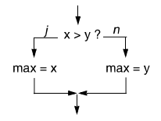
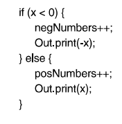
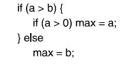
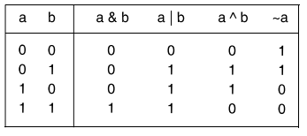
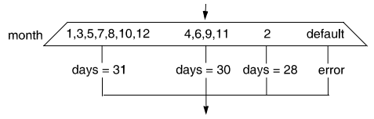
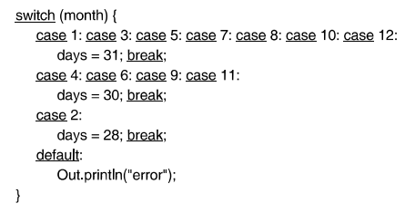
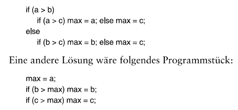

# Programmieren mit Java Chapter 3

## Verzweigungen

- Probleme müssen in Teile zerlegt werden und sind Abhängig von Bedingungen
- If und Switch Anweisungen können Programmfluss teilen und wieder zusammenführen

### If-Anweisung

- Prüft ob eine Bedingung wahr oder falsch ist
- Jeweils wird unterschiedlicher Code ausgeführt (If-Zweig, Else-Zweig)
- Else ist optional
- Bedingungen müssen einen boolischen Wert ergeben, also wahr oder falsch sein
- Bedingungen sollten eingerückt werden mit Indentations um Verschachtelung erkennbarer zu machen
- **if (x>y) max = x; else max =y;** sieht wie folgt aus:

### Anweisungsblöcke

- In If oder Else können ganze Blöcke an Code ausgeführt werden
- Code-Blöcke werden von {geschweiften Klammern} umgeben
- Anweisungen in Blöcken werden sequentiell ausgeführt

### Dangling Else

- bei mehreren Ifs mit einem else am Ende bezieht sich das else immer auf das letzte if in Java
- Wenn man dies nicht möchte muss ein if als Codeblock geklammert werden

## Boolsche Ausdrücke

### Vergleichsoperatoren

- gleich **x==3**
- ungleich **x!=3**
- größer **x>3**
- kleiner **x<3**
- größergleich **x>=3**
- kleinergleich **x<=3**

### Boolean

- Boolean halten Wahrheitswerte true oder false
- Können auch durch Vergleichsoperatoren entstehen wie p = (p || q) && x < 10;

### Zusammengesetzte Vergleiche

- UND **x&&y**
- ODER **x||y**
- Negation **!x**
- Werden meist genutzt um in Bedinungen einzubauen und Ausführung von Codeblöcken zu steuern
- Können beliebig verknüpft werden if(0 <= x && x<=10 || 100 <= x && x <= 110)y=x;

### Kurzschlussauswertung

- Java bricht die Auswertung eines Vergleiches sofort ab, sofern etwas nicht mehr zustimmen kann und schaut sich den Vergleich gar nicht bis zum Ende an
- if (y !=0 && x/y > 10)... ist hier y gleich 0 wird der Rest nicht betrachtet
- Fehler die durch Typen und Divisionen entstehen würden tauchen so nicht auf, da sie nicht betrachtet werden. Kann genutzt werden um nur in bestimmten Fällen Dinge zu tun und Fehler zu vermeiden.
- Short Cuircuting wird meistens mit dem && Operator gemacht, weil dieser direkt beim false abbricht, da alles wahr sein muss für eine Ausführung oder Betrachtung des nächsten Vergleichoperators

### Bitweise logische Verknüpfung

- Zahlen werden in Binärdarstellung gespeichert
- Bitweises Und 10 & 3 = 2 (1010 & 0011 = 0010)
- Bitweises Oder 10 | 3 = 11 (1010 | 0011 = 1011)
- Bitweises Exklusives Oder 10 ^ 3 = 9 (1010 ^ 0011 = 1001)
- Einerkomplement ~10 = ~11 (~00001010 = 11110101)

### Vorrangregeln

- ! bindet stärker als && und && bindet stärker als ||
- Bitweise gilt ~ bindet stärker als & bindet stärker als | und ^
- !(y==0)||0<x&&x<10 wird zuerst !(y==0) berechnet, falls es true ist ist alles bereits true und beendet. Ansonsten wird weitergeschaut wenn 0<x false ist wird abgebrochen da && auf beiden Seiten wahr sein muss. 

### Switch Anweisungen

- Switch ist eine Mehrwegverzweigung
- Es wird explizit eine Bedingung angegeben (Klammer hinter switch) und dann nur die verschiedenen Cases definiert
- Default ist optional und gibt einen Case an der ausgeführt wird wenn kein anderer zutrifft
- Break sagt, dass der Switch und die Bedingungen verlassen werden sollen
- Break ist sehr wichtig, da Java diesen in switches benötigt zur korrekten Ausführung
- Switches sind schneller als verschachtelte Ifs und besser lesbar benötigen aber mehr Speicherplatz da für den Case Speicher reserviert wird
- Für dutzende bis hunderte Cases sind ifs besser geeignet

### Assertionen bei Verzweigungen

- Assertions sind Zusicherungen die als Kommentare den jeweiligen Zustand/Wert von Code oder Variablen an einem Zeitpunkt bestimmt
- DeMorgan lässt Negationen umformen !(a && b) = !a || !b sowie !(a || b) = !a && !b
- Es ändert sich der Operator von UND zu ODER sowie andersherum und jeder Operand erhält eine Negation

### assert

- Mit dem Keyword assert können Anweisungen überprüft werden assert <= b &&  <= c : 10; sowie assert x >= 0 : "negative value of x"
- Wenn der Ausdruck hinter dem Doppelpunkt false ist bricht das Programm ab mit Fehlermeldung
- Wird nur dann ausgeführt wenn das Programm -enableassertions aktiviert hat aus Performancegründen
- Ausführung mit java -enableassertions MyProgram

### Effizientüberlegung

- Oftmals lassen sich Algorithmen oder Anweisungen optimieren
- Besser kann hierbei statische Kürze sein, also weniger Text. Kürzere Programme haben oft weniger Fehler und sind einfacher lesbar. 
- Es kann auch dynamische Kürze sein, bei der es darum geht welches schneller läuft. Das zweit Programm ist es Abhängig welche Variablen das Maximum ist und kann durchschnittlich langsamer sein
- Lesbarkeit ist ein wesentlicher Faktor und kürzere Programme sind einfacher zu überblicken das zweite Programm ist weniger verschachtelt

