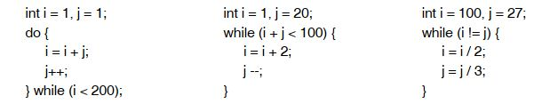

# Chapter 4 - Exercises

### 1) Schleifenterminierung, welche der Schleifen wird terminiert?



- a terminiert, da j hochgezählt wird und in i gespeichert wird. Damit wird i großer als 200 werden.
- b terminiert, da i um zwei erhöht wird aber j nur ein eins vermindert wird. i + j wird größer 200 werden.
- c terminiert, da int beide auf 0 am Ende stehen.

### 2) Anzahl der Ziffern einer Zahl als Java Programm für ganzzahlige und positive Zahl.

```
// Given one input variable as a positive integer the program prints the amount of numbers it contains
public class IntCountNumber {

    public static void main(String[] args) {
        Out.print("Bitte eine Ganzzahl für die Nummer ein!"); // Input prompt to user
        int input = In.readInt(); // Read input as integer
        int amount = 1;

        while (input > 10) {
            amount++;
            input = input / 10;
        }
        Out.print(amount);
    }
}
```

### 3) Java-Programm dass die Ziffernsumme einer Zahl x berechnet uns ausgibt.

```
// Given one input variable as a positive integer the program prints of the numbers left to right
public class IntCountSum {

    public static void main(String[] args) {
        Out.print("Bitte eine Ganzzahl für die Nummer ein!"); // Input prompt to user
        int input = In.readInt(); // Read input as integer
        int sum = 0;

        while (input > 0) {
            sum += input % 10;
            input /= 10;
        }
        Out.print(sum);
    }
}
```

### 4) Wandeln Sie folgende Schleife in eine While und eine do-while Schleife um:
```
// Gegeben
int s = 0;
for (;;) {
    int x = In.readInt();
    if (x < 0) break;
    s = s + x;
}
```

```
// WHILE
int s = 0;
int x = In.readInt();

for (x >= 0) {
    s = s + x;
    x = ln.readInt();
}
```

```
// DO WHILE
int s = 0;

do {
    int x = In.readInt();
    if(x>=0)s=s+x;
}while(x>=0);
```

### 5) Java-Programm für Binärzahleinlese das eine Binärzahl 00000000000000000000000000101100 in Menge {2, 3, 5} zurückgibt. Dabei kann man die letzte Binärziffer einer Zahl n durch n/2 abstalten mittels n % 2 prüfen ob sie 0 oder 1 ist.

```
// Given a binary number outputs the sets as ints of this number
public class BinaryToInt {

    public static void main(String[] args) {
        Out.print("Bitte eine Binaerzahl ein!"); // Input prompt to user
        int binary = In.readInt(); // Read input as integer

            Out.print('{');
            int pos = 0;
            boolean first = true;
            while (binary > 0) {
                if (binary % 2 == 1) {
                    if (first) first = false; else Out.print(',');
                    Out.print(pos);
                }
                binary = binary / 2; pos++;
            }
            Out.println('}');
    }
}
```

### 6) Java-Programm für Einlese einer Zahlenfolge aus einer Textdatei, die den größten, kleinsten Wert und Mittelwert ausgibt.


